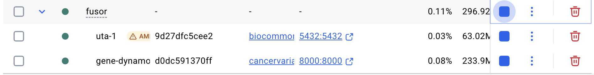

<h1 align="center">
FUSOR
</h1>

[](https://pypi.python.org/pypi/fusor)
[](https://pypi.python.org/pypi/fusor)
[](https://pypi.python.org/pypi/fusor)
[](https://github.com/cancervariants/fusor/actions/checks.yaml)
[](https://doi.org/10.5281/zenodo.12708252)


---

**[Documentation](https://fusor.readthedocs.io/stable/)** · [Installation](https://fusor.readthedocs.io/stable/install.html) · [Usage](https://fusor.readthedocs.io/stable/usage.html) · [API reference](https://fusor.readthedocs.io/stable/reference/index.html)

---

## Overview

<!-- description -->
FUSOR (**FUS**ion **O**bject **R**epresentation) provides modeling and validation tools for representing gene fusions in a precise, computable structure that adheres to the [VICC Gene Fusion Specification](https://fusions.cancervariants.org). It also provides easy access to transcript selection and coordinate conversion tools, and enables generation of human-readable fusion [nomenclature](https://fusions.cancervariants.org/en/latest/nomenclature.html).
<!-- /description -->

## Install

FUSOR is available on [PyPI](https://pypi.org/project/fusor):

```shell
python3 -m pip install fusor
```

See the [installation instructions](https://fusor.readthedocs.io/stable/install.html) in the documentation for a description of dependency setup requirements.

### Docker
FUSOR's dependencies can be installed using a Docker container.

> [!IMPORTANT]
> This section assumes you have a local [SeqRepo](https://github.com/biocommons/biocommons.seqrepo)
installed at `/usr/local/share/seqrepo/2024-12-20`. If you have it installed elsewhere,
please update add a `SEQREPO_ROOT_DIR` environment variable in
[compose.yaml](./compose.yaml) and [.env.shared](./.env.shared).\
> If you're using Docker Desktop, you must go to Settings -> Resources -> File sharing
and add `/usr/local/share/seqrepo` under the `Virtual file shares` section. Otherwise,
you will get the following error:
`OSError: Unable to open SeqRepo directory /usr/local/share/seqrepo/2024-12-20`.

To build, (re)create, and start containers

```shell
docker volume create uta_vol
docker compose up
```

> [!TIP]
> If you want a clean slate, run `docker compose down -v` to remove containers and
> volumes, then `docker compose up --build` to rebuild and start fresh containers.

In Docker Desktop, you should see the following for a successful setup:



> [!NOTE]
> [python-dotenv](https://pypi.org/project/python-dotenv/) can be used to load environment
> variables needed for analysis notebooks in the `notebooks` directory.
> Environment variables can be located at [.env.shared](./.env.shared).
---

## Usage

Fusion and subcomponent constructors are provided through a core `FUSOR` class:

```pycon
>>> from fusor import FUSOR
>>> f = FUSOR()
>>> fusion = f.fusion(
...     structure=[
...         {
...             "type": "GeneElement",
...             "gene": {
                    "primaryCoding": {
    ...                 "id": "hgnc:3508",
                        "code": "HGNC:3508",
                        "system": "https://www.genenames.org/data/gene-symbol-report/#!/hgnc_id/"
                    }
                    "conceptType": "Gene",
                    "name": "EWSR1"
...             }
...         },
...         {
...           "type": "UnknownGeneElement"
...         }
...     ],
...     assay={
...         "type": "Assay",
...         "methodUri": "pmid:33576979",
...         "assayId": "obi:OBI_0003094",
...         "assayName": "fluorescence in-situ hybridization assay",
...         "fusionDetection": "inferred",
...     },
... )
>>> fusion.type
<FUSORTypes.ASSAYED_FUSION: 'AssayedFusion'>
```

See the [usage](https://fusor.readthedocs.io/stable/usage.html) section in the documentation for more features and code examples.

---

## Feedback and contributing

We welcome bug reports, feature requests, and code contributions from users and interested collaborators. The [documentation](https://fusor.readthedocs.io/stable/contributing.html) contains guidance for submitting feedback and contributing new code.
